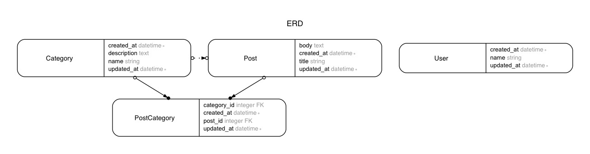

# Selectize app
- [Rails - Selectize field with modal add form](https://gist.github.com/mnishiguchi/38c46c8ddba5c92cfb1169521f9397c6)

---

## UI flow

- User types a word and hit the `Add ...` button. -> Modal opens with an add form.
- User fill the new-category form and submit.     -> The form data is persisted to the database
- If user closes the modal without submitting the form, the form will be cleared and the modal will close.

---

## erd

---

## References

- https://selectize.github.io/selectize.js
- https://gorails.com/episodes/select-or-create-with-selectize-js
- https://github.com/gorails-screencasts/gorails-episode-178
